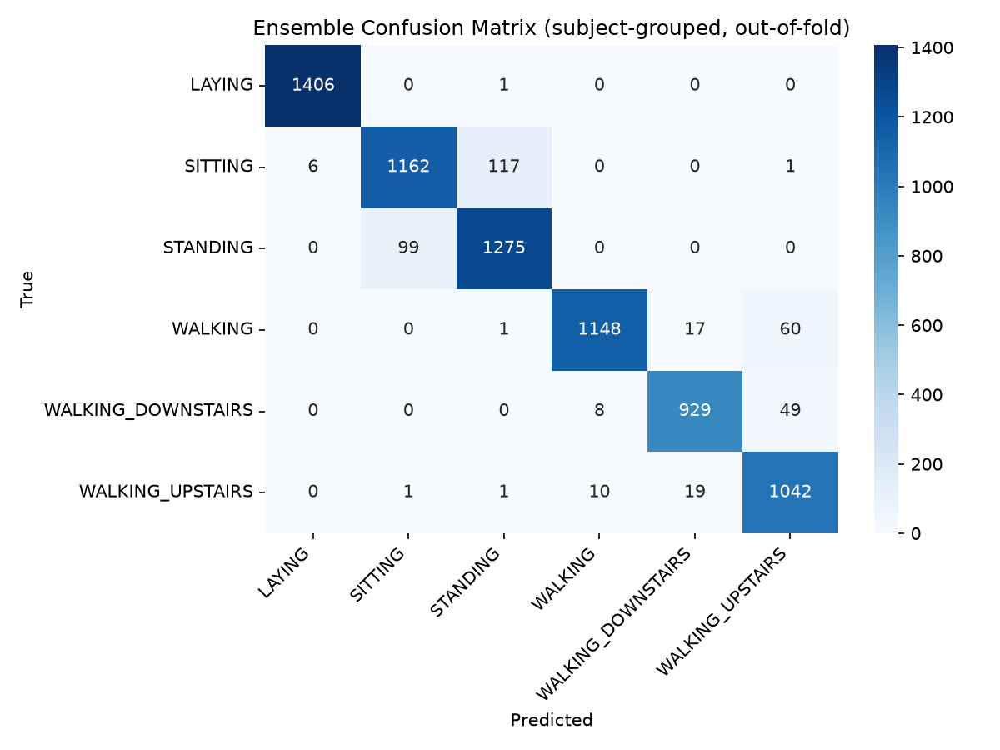

# Human Activity Recognition — Data Challenge

Bachelor semester project for the **Foundations of Machine Learning** course (4th semester, Technische Hochschule Brandenburg). The task was a "Data Challenge": given labeled smartphone sensor data, prepare it, explore it, train and evaluate several classifiers, and hand in predictions for an unlabeled hold-out set.

## Task

Recognize six human activities — `WALKING`, `WALKING_UPSTAIRS`, `WALKING_DOWNSTAIRS`, `SITTING`, `STANDING`, `LAYING` — from smartphone accelerometer/gyroscope measurements, then apply the final model to a set of unseen recordings and submit the predicted activity labels.

The dataset is the public **UCI Human Activity Recognition Using Smartphones** dataset (Anguita, Ghio, Oneto, Parra, Reyes-Ortiz, ESANN 2013): 30 volunteers wearing a Samsung Galaxy S II on the waist, 3-axial acceleration + 3-axial angular velocity at 50 Hz, summarized into a 561-feature vector (time- and frequency-domain statistics) per 2.56 s sliding window. The course provided an adapted copy of it (`Data2024/`) with a labeled training file (`measures.csv`) and an unlabeled file to predict (`to_predict.csv`).

## Repository layout

```
.
├── Data2024/                        # course-provided dataset (gitignored, not in repo)
├── VSC_Preprocess_Models&Compare/   # Python/scikit-learn notebooks (preprocessing, EDA, models, comparisons)
│   └── improved_pipeline.ipynb      # leakage-free evaluation, tuning, ensemble (see Methods §3)
├── Predictions/                     # per-model prediction outputs on to_predict.csv (gitignored)
├── images/                          # figures: RapidMiner screenshots, EDA plots, confusion matrix
├── Decision_Tree.rmp                # RapidMiner process: AdaBoost + Decision Tree (gitignored)
├── LR_DT_RF_FLM_Models.rmp          # RapidMiner process: further model comparison (gitignored)
├── Microsoft Excel-Arbeitsblatt (neu).xml   # small exploratory RapidMiner process (gitignored)
├── DataChallenge.docx               # task sheet (gitignored)
├── Einreichung.docx                 # submitted report (gitignored)
├── L6_data_challenge.pdf            # lecture slides for the task (gitignored)
├── es2013-84.pdf                    # original dataset publication, external (gitignored)
└── requirements.txt
```

Two parallel toolchains were used for this project: RapidMiner (the originally submitted analysis) and Jupyter notebooks (exploration, and later the leakage-free improved pipeline). The RapidMiner process files are kept locally but are gitignored, so they won't appear if you clone the repo.

## Methods

### 1. RapidMiner pipeline (the submitted analysis)

The report (`Einreichung.docx`) and its models were built in **RapidMiner Studio 10.4**. Pipeline, per `Decision_Tree.rmp` / `LR_DT_RF_FLM_Models.rmp` and the screenshots in `images/`:

1. `Read CSV` → `Filter Examples` splits train/test **by subject** (`subject <= 23` → train, `subject >= 25` → test), giving a subject-disjoint ~70/30 split.
2. `Set Role` marks `activity` as the label and excludes `subject` as an id (not used as a predictive feature).
3. `Replace Missing Values` → `Normalize`.
4. 10-fold `Cross Validation` on the training set, comparing:
   - **Stacking**: base learners Random Forest + Naive Bayes + Deep Learning, meta learner Decision Tree.
   - **AdaBoost**: 5 iterations of Decision Tree.
5. Best model (Stacking) applied to the held-out test set, then to `to_predict.csv`, exported as `my_prediction.csv` — the file that was actually submitted for the challenge.

**CV results (10-fold, training set):**

| Model | CV Accuracy | CV Kappa |
|---|---|---|
| Stacking (RF + Naive Bayes + Deep Learning → Decision Tree) | 96.82% ± 0.99% | 0.962 ± 0.012 |
| AdaBoost (5× Decision Tree) | 94.77% ± 1.21% | 0.937 ± 0.015 |

Stacking was chosen as the final model; applied to the subject-disjoint test set it reached a **test error of 9.14%** (≈ 90.9% test accuracy).

### 2. Python / scikit-learn exploration (`VSC_Preprocess_Models&Compare/`)

A second, exploratory pass re-implemented preprocessing and several models in Python:

- **`preprocess_rename_dup.ipynb`** — the raw exports had duplicate column names; this notebook converts comma-decimals to floats and suffixes duplicate columns with their index to make them unique (→ `edited_*.csv` / `edited2_*.csv`).
- **`Correlatoin_Boxplot_Scatter.ipynb`, `DC.ipynb`** — EDA: class distribution, a depth-limited Decision Tree for feature importance, boxplots of the most important feature per class, correlation matrix, strongest-correlation scatterplot, pairplot of top features.
- **`randomforest.ipynb`, `xgb.ipynb`, `NN.ipynb`, `stack.ipynb`** — one classifier each (Random Forest, XGBoost, MLP neural network, and an AdaBoost+SVC→LogisticRegression stacking classifier), each trained on a 70/30 split and then applied to `to_predict.csv`, writing its own file into `Predictions/`.
- **`L7_ensemble_methods_exercise.ipynb`** — a course exercise comparing Random Forest, XGBoost, and Stacking side by side.
- **`comparing_result.ipynb`, `cmp.ipynb`** — pairwise agreement checks between the different models' predictions on `to_predict.csv` (how many rows they predict the same/differently), summarized in `Predictions/compare_activities.csv`.

**Holdout accuracy (single 70/30 or 80/20 split, not cross-validated):**

| Model | Accuracy |
|---|---|
| XGBoost | 99.46% |
| Neural Network (MLP, 2×100 hidden units) | 98.91% |
| Random Forest (100 trees) | 98.37% |
| Stacking (AdaBoost + SVC → Logistic Regression) | 94.65% |

### Key EDA finding

A depth-limited Decision Tree splits almost perfectly on gravity/orientation features — the root split (`tGravityAcc-min()-X <= 0.10`) already isolates `LAYING` from every other activity, since the phone's orientation relative to gravity differs fundamentally when lying down. The top features by importance were `tGravityAcc-min()-X`, `fBodyAcc-mad()-X`, `angle(Y,gravityMean)`, `tBodyAccMag-std()`, and `tGravityAcc-arCoeff()-Z,1`.

### 3. Improved pipeline — leakage-free evaluation, tuning, ensemble (`improved_pipeline.ipynb`)

The Python notebooks in §2 all leave `subject` in the feature matrix and use a random 70/30 split, which lets a model partly learn *who* is moving rather than *what* they're doing — and `to_predict.csv` contains entirely different subjects than `measures.csv` (verified: the two files don't share a single subject ID), so that inflated accuracy would not have carried over to the actual submission. `improved_pipeline.ipynb` redoes the evaluation properly and was run end-to-end (all numbers below are real output, not estimates):

1. **Quantify the leakage.** Same Random Forest, two setups: subject-as-feature + random split ("naive") vs. subject excluded + 5-fold `StratifiedGroupKFold` grouped by subject ("honest").

   | Setup | Accuracy |
   |---|---|
   | Naive (subject as feature, random split) | 98.41% |
   | Honest (no subject feature, subject-grouped CV) | 90.70% ± 4.93% |

   **The leakage alone accounts for a 7.72 percentage-point gap** — almost exactly the same accuracy the RapidMiner pipeline got (90.9%) with its correct subject-disjoint split. That's strong evidence the RapidMiner number was the honest one all along, and the higher Python numbers in §2 were an artifact of the split, not better modeling.

2. **Tune each model with `RandomizedSearchCV` (15 iterations) under the same subject-grouped 5-fold CV**, so every candidate is scored the honest way:

   | Model | Honest grouped-CV accuracy |
   |---|---|
   | Ensemble (tuned RF + tuned XGBoost + tuned MLP, soft voting) | **94.70%** (Cohen's κ 0.936) |
   | XGBoost (tuned) | 94.14% |
   | MLP (tuned) | 93.74% |
   | Random Forest (tuned) | 92.35% |
   | Random Forest (untuned baseline) | 90.70% |

   Tuning alone recovers most of the naive/honest gap, and the soft-voting ensemble of all three tuned models edges out every individual model.

3. **Confusion matrix** (out-of-fold predictions from the subject-grouped CV, saved as `images/confusion_matrix_ensemble_grouped_cv.png`):

   

   `LAYING` is separated almost perfectly (as expected from the EDA finding above). The dominant confusion is **`SITTING` vs. `STANDING`** (117 + 99 = 216 of the 390 total misclassifications, ~55%) — both are static poses with very similar waist-level accelerometer/gyroscope signatures, so this is a genuine, physically-explainable weak spot rather than a modeling bug. A smaller amount of confusion exists between `WALKING`/`WALKING_UPSTAIRS`/`WALKING_DOWNSTAIRS`, which is similarly expected (all three are dynamic gait activities).

4. **Final predictions**: the tuned ensemble, refit on all of `measures.csv`, applied to `to_predict.csv` → `Predictions/ensemble_predictions_grouped_cv.csv` (gitignored like the rest of `Predictions/`; regenerate by rerunning the notebook). A `Predictions/model_comparison_honest_cv.csv` summary is written alongside it.

## Output of this project

- **Originally submitted model**: RapidMiner Stacking classifier, ~90.9% accuracy on a subject-disjoint test set, predictions in `my_prediction.csv`.
- **Improved model** (see §3 above): a tuned RF+XGBoost+MLP soft-voting ensemble, **94.70% honest (subject-grouped) accuracy**, predictions in `Predictions/ensemble_predictions_grouped_cv.csv`. This is the more trustworthy and higher-accuracy result — evaluated the same way the RapidMiner pipeline was (no subject leakage), so the improvement over 90.9% is real, not a split artifact.
- **`Predictions/`** (gitignored): one CSV per model with predicted `activity` labels for `to_predict.csv`, plus comparison summaries (`compare_activities.csv`, `model_comparison_honest_cv.csv`).
- **`Einreichung.docx`** (gitignored): the originally submitted written report — introduction, data preparation, EDA, model selection/evaluation, final results.

## Limitations / notes

- The four original per-model notebooks (`randomforest.ipynb`, `xgb.ipynb`, `NN.ipynb`, `stack.ipynb`) still only drop the `activity` column before training, leaving `subject` in as a feature and using a random 70/30 split — this is the leakage quantified and fixed in `improved_pipeline.ipynb` (§3). Those four notebooks were left unmodified as historical record of the original exploration; the honest numbers are in the improved pipeline, not in them.
- Some notebooks assume they're run from the repo root, others from inside `VSC_Preprocess_Models&Compare/` (relative paths like `../measures.csv` vs `measures.csv`) — check a notebook's `read_csv` calls before running it.
- `preprocess_rename_dup.ipynb` writes to a `../new/` directory that doesn't exist in this repo; create it first or adjust the output path if you re-run that cell.
- `improved_pipeline.ipynb`'s hyperparameter search spaces are intentionally modest (15 random iterations each) to keep runtime to a few minutes on a laptop; a wider/longer search would likely push accuracy a bit further.

## Setup

The dataset itself is **not included** in this repository (see below) — get `Data2024/` from the course materials and place it at the repo root before running anything.

```bash
python3 -m venv .venv
source .venv/bin/activate
pip install -r requirements.txt
jupyter lab   # open notebooks under VSC_Preprocess_Models&Compare/
```

Verified working with Python 3.14 (pandas, numpy, scikit-learn, xgboost, matplotlib, seaborn, jupyter — see `requirements.txt`).

The `.rmp` files are RapidMiner processes (gitignored, kept locally — see below); open them with RapidMiner Studio (built with 10.4) to inspect or re-run the original pipeline.

## What's excluded from version control

See `.gitignore`. Deliberately not published:

- **Data**: `Data2024/`, `Data2024.zip`, and every `*.csv` in the repo (raw and edited measurement files, plus everything in `Predictions/`, including the new ensemble predictions and comparison CSV from §3) — this was provided by the course for the challenge, not ours to redistribute.
- **Task and report documents**: `DataChallenge.docx` (task sheet), `Einreichung.docx` (submitted report), `L6_data_challenge.pdf` (lecture slides), `es2013-84.pdf` (the original dataset publication, an external paper).
- **RapidMiner files**: every `*.rmp` process and `*.xml` file.

Jupyter notebooks (`.ipynb`), figures (`images/`), and this README are tracked. The RapidMiner side of the project (§Methods 1) is documented here and in the screenshots under `images/`, but its source `.rmp`/`.xml` files stay local-only — get them from whoever has this repo's local copy if you need to open them in RapidMiner Studio.
